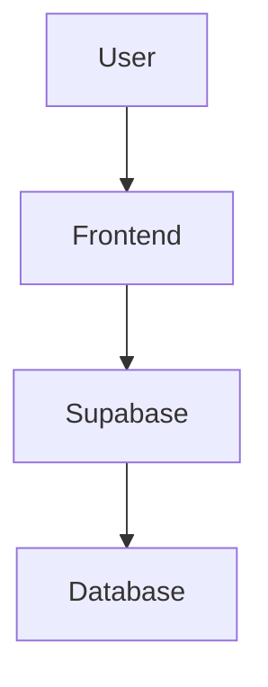

# Documentation Style Guide

**Project:** FoodShare Documentation Standards
**Type:** Technical Documentation Guidelines
**Last Updated:** November 2025
**Version:** 1.0.0

---

## Table of Contents

- [Purpose](#purpose)
- [Document Structure](#document-structure)
- [Writing Style](#writing-style)
- [Formatting Guidelines](#formatting-guidelines)
- [Code Examples](#code-examples)
- [File Organization](#file-organization)
- [Maintenance](#maintenance)

---

## Purpose

This style guide ensures consistency, clarity, and professionalism across all FoodShare documentation. Following these guidelines helps developers quickly find information and understand the codebase.

### Target Audience

- **New developers** - Getting started with the project
- **Contributors** - Adding features or fixing bugs
- **Maintainers** - Long-term project stewardship
- **AI assistants** - Claude Code and similar tools

---

## Document Structure

### Document Header

Every documentation file MUST include a standard header:

```markdown
# Document Title

**Project:** FoodShare - Brief Description
**Type:** Document Category (e.g., "Vite + React 19 SPA")
**Last Updated:** Month Year (e.g., "November 2025")
**Version:** Semantic Version (e.g., "1.0.0")

---
```

**Example:**

```markdown
# API Reference

**Project:** FoodShare - API Layer Documentation
**Type:** API Documentation
**Last Updated:** November 2025
**Version:** 1.0.0

---
```

### Table of Contents

Documents longer than 100 lines SHOULD include a table of contents:

```markdown
## Table of Contents

- [Section One](#section-one)
- [Section Two](#section-two)
  - [Subsection](#subsection)
- [Section Three](#section-three)
```

### Document Footer

Every document MUST end with metadata and navigation:

```markdown
---

**Last Updated:** November 2025
**Maintained By:** FoodShare Development Team
**Status:** Living document / Stable / Deprecated

---

## Quick Navigation

- [Back to Index](INDEX.md)
- [Related Document](RELATED.md)
- [Another Document](OTHER.md)
```

---

## Writing Style

### Voice and Tone

- **Active voice** - "The API fetches data" (not "Data is fetched by the API")
- **Present tense** - "The function returns" (not "The function will return")
- **Direct and concise** - Avoid unnecessary words
- **Professional but friendly** - Clear without being condescending

### Clarity Principles

1. **One idea per sentence** - Keep sentences focused
2. **Short paragraphs** - 3-5 sentences maximum
3. **Specific examples** - Show, don't just tell
4. **Avoid jargon** - Define technical terms on first use

### Writing Examples

**Good:**

```markdown
The `useDebounce` hook delays value updates for performance.
Pass a value and delay (in milliseconds) to debounce changes.
```

**Bad:**

```markdown
The useDebounce custom hook facilitates the implementation of
debouncing functionality which can be utilized to optimize
performance in various scenarios where immediate updates might
be detrimental to user experience or system resources.
```

---

## Formatting Guidelines

### Headings

Use ATX-style headings (`#`) with proper hierarchy:

```markdown
# H1 - Document Title (only one per file)

## H2 - Major Sections

### H3 - Subsections

#### H4 - Minor Subsections
```

**Rules:**

- Only ONE `#` heading per file (the title)
- Don't skip heading levels (H2 → H4 is wrong)
- Use sentence case: "Feature overview" (not "Feature Overview")
- No punctuation at end of headings

### Lists

**Unordered lists** - Use `-` for consistency:

```markdown
- First item
- Second item
  - Nested item (2 spaces indent)
  - Another nested item
- Third item
```

**Ordered lists** - Use `1.` for all items (Markdown auto-numbers):

```markdown
1. First step
1. Second step
1. Third step
```

**DO NOT manually number:**

```markdown
❌ Bad:

1. First step
2. Second step
3. Third step (renumbering required if order changes)
```

### Emphasis

- **Bold** - Use `**text**` for important concepts, UI elements
- _Italic_ - Use `*text*` sparingly for emphasis
- `Code` - Use backticks for code, filenames, commands

**Examples:**

```markdown
- Click the **Save** button to save your changes
- The _recommended_ approach is to use TypeScript
- Edit the `vite.config.ts` file
- Run `npm run dev` to start the server
```

### Links

**Internal links** - Use relative paths:

```markdown
See the [Architecture Overview](ARCHITECTURE.md) for details.
Check the [API Reference](API_REFERENCE.md#productapi) for methods.
```

**External links** - Include descriptive text:

```markdown
[React documentation](https://react.dev)
[Vite build tool](https://vitejs.dev)
```

**DO NOT use bare URLs:**

```markdown
❌ Bad: https://react.dev
✅ Good: [React documentation](https://react.dev)
```

---

## Code Examples

### Inline Code

Use single backticks for:

- Filenames: `package.json`
- Commands: `npm install`
- Variables: `userEmail`
- Functions: `getProducts()`
- Paths: `src/components/`

### Code Blocks

Use triple backticks with language identifier:

````markdown
```typescript
// TypeScript example
export const fetchData = async () => {
  const { data, error } = await supabase.from("posts").select("*");
  return data;
};
```
````

**Supported languages:**

- `typescript` / `tsx` - TypeScript/TSX
- `javascript` / `jsx` - JavaScript/JSX
- `json` - JSON files
- `bash` - Shell commands
- `markdown` - Markdown examples
- `css` - CSS styles

### Code Example Guidelines

1. **Keep examples short** - 10-20 lines maximum
2. **Include comments** - Explain non-obvious code
3. **Use realistic names** - `productAPI` not `myAPI`
4. **Show context** - Include imports if needed
5. **Test examples** - Ensure code actually works

**Good example:**

````markdown
```typescript
import { useAppSelector } from '@/hook/hooks';
import { selectProducts } from '@/store/slices/productsSelectors';

export const ProductList = () => {
  // Get products from Redux store
  const products = useAppSelector(selectProducts);

  return products.map((product) => (
    <ProductCard key={product.id} {...product} />
  ));
};
```
````

### File Path References

Always use full absolute paths from project root:

```markdown
✅ Good: `/Users/organic/dev/work/foodshare/frontend/src/api/productAPI.ts`
✅ Good: `src/api/productAPI.ts` (relative to project root)
❌ Bad: `api/productAPI.ts` (ambiguous)
❌ Bad: `./productAPI.ts` (relative to unknown location)
```

---

## Tables

### Table Formatting

Use pipe tables with proper alignment:

```markdown
| Column 1 | Column 2 | Column 3 |
| -------- | -------- | -------- |
| Value 1  | Value 2  | Value 3  |
| Value 4  | Value 5  | Value 6  |
```

**With alignment:**

```markdown
| Left-aligned | Center-aligned | Right-aligned |
| :----------- | :------------: | ------------: |
| Text         |      Text      |           123 |
| More text    |   More text    |           456 |
```

### Table Guidelines

1. **Keep tables simple** - Maximum 5 columns
2. **Short cell content** - Break long text into multiple rows
3. **Header row required** - Always include headers
4. **Consistent spacing** - Align pipes for readability

---

## Special Elements

### Callouts and Alerts

Use blockquotes with emoji for callouts:

```markdown
**Note:** This is a general note about something.

**Important:** Pay special attention to this.

**Warning:** Be careful with this operation.

**User Story:**

> As a food sharer, I want to post my surplus vegetables
> so neighbors can collect them easily.
```

### Status Indicators

Use consistent emoji and labels:

```markdown
**Status:** ✅ Stable
**Status:** 🚧 Partial / In Development
**Status:** 📋 Planned
**Status:** ⚠️ Deprecated
**Status:** ❌ Not Implemented
```

**Priority levels:**

```markdown
**Priority:** P0 (Critical)
**Priority:** P1 (High)
**Priority:** P2 (Medium)
**Priority:** P3 (Low)
```

### Diagrams

Use ASCII art or code blocks for simple diagrams:

```markdown

```

┌─────────────────────────────────┐
│ Presentation │
├─────────────────────────────────┤
│ Domain │
├─────────────────────────────────┤
│ Data │
├─────────────────────────────────┤
│ Infrastructure │
└─────────────────────────────────┘

```

```

For complex diagrams, use Mermaid syntax:

````markdown

````

---

## File Organization

### Documentation Directory Structure

```
context/
├── INDEX.md                    # Overview and navigation hub
├── ARCHITECTURE.md             # System architecture
├── DATABASE_SCHEMA.md          # Database structure
├── FOLDER_STRUCTURE.md         # Project organization
├── API_REFERENCE.md            # API documentation
├── DEVELOPMENT_GUIDE.md        # Development workflows
├── TECH_STACK.md               # Technology details
├── FEATURES.md                 # Feature documentation
├── STYLE_GUIDE.md              # This file
└── ultrathink.md               # Philosophy and patterns
```

### File Naming Conventions

- **Use UPPERCASE.md** for main documentation (INDEX.md, not index.md)
- **Use underscores** for multi-word files (FOLDER_STRUCTURE.md)
- **Keep names descriptive** but concise
- **No spaces** in filenames

### File Size Guidelines

- **Ideal size:** 200-500 lines
- **Maximum size:** 1000 lines (split if larger)
- **Minimum size:** No minimum (even 1-line files are OK if needed)

---

## Content Organization

### Section Order

Standard section order for documentation:

1. **Title and metadata** (header)
2. **Table of contents** (if needed)
3. **Overview** - What is this about?
4. **Main content** - Core information
5. **Examples** - Practical usage
6. **Reference** - Detailed specifications
7. **Related topics** - Cross-references
8. **Footer** - Metadata and navigation

### Cross-Referencing

Always link to related documentation:

```markdown
For more details, see:

- [Architecture Overview](ARCHITECTURE.md) - System design
- [API Reference](API_REFERENCE.md) - API methods
- [Development Guide](DEVELOPMENT_GUIDE.md) - Workflows
```

---

## Maintenance

### Version Control

- **Update "Last Updated"** - Change month/year when editing
- **Update version** - Increment version on major changes
  - 1.0.0 → 1.1.0 (minor update)
  - 1.1.0 → 2.0.0 (major update)

### Review Schedule

- **Monthly** - Review INDEX.md and quick start guides
- **Quarterly** - Review all documentation for accuracy
- **With major releases** - Full documentation update

### Deprecation Process

When deprecating documentation:

1. Add deprecation warning at top:

   ```markdown
   **⚠️ DEPRECATED:** This document is outdated.
   See [New Document](NEW.md) instead.
   ```

2. Update status in footer:

   ```markdown
   **Status:** ⚠️ Deprecated (as of November 2025)
   ```

3. Remove from INDEX.md navigation

4. Archive after 3 months (move to `context/archive/`)

---

## Documentation Types

### API Reference

**Structure:**

````markdown
## FunctionName

Description of what the function does.

**Parameters:**

- `param1` (type) - Description
- `param2` (type) - Description

**Returns:**

- `ReturnType` - Description

**Example:**

```typescript
const result = await functionName(param1, param2);
```
````

**Errors:**

- `ErrorType` - When this error occurs

````

### Tutorial/How-To

**Structure:**
```markdown
## Task Title

What you'll accomplish in this guide.

**Prerequisites:**
- Requirement 1
- Requirement 2

**Steps:**

1. **First step**
   ```bash
   command here
````

Explanation of what this does.

2. **Second step**
   ```typescript
   code here
   ```
   Explanation of what this does.

**Result:**
What you should see after completion.

**Troubleshooting:**

- Problem X → Solution Y
- Problem A → Solution B

````

### Reference Documentation

**Structure:**
```markdown
## Concept Name

Brief definition.

**Properties:**
| Property | Type | Description |
|----------|------|-------------|
| prop1    | Type | Description |

**Usage:**
```typescript
example usage
````

**Notes:**
Additional important information.

`````

---

## Writing Checklist

Before committing documentation changes:

- [ ] Title and metadata present
- [ ] Table of contents (if >100 lines)
- [ ] Clear headings with proper hierarchy
- [ ] Code examples tested and working
- [ ] Internal links use relative paths
- [ ] External links include descriptions
- [ ] File paths are absolute or from project root
- [ ] Consistent formatting (bold, italic, code)
- [ ] Footer with metadata and navigation
- [ ] Spell check completed
- [ ] Technical accuracy verified
- [ ] Cross-references updated

---

## Common Mistakes

### ❌ Avoid These

1. **Vague language**
   - Bad: "You can use this for stuff"
   - Good: "Use this hook to debounce search input"

2. **Outdated information**
   - Always update "Last Updated" date
   - Remove deprecated features

3. **Missing context**
   - Bad: "Run the command"
   - Good: "Run `npm install` to install dependencies"

4. **Inconsistent terminology**
   - Pick one term and stick with it
   - "Product" or "Listing" (not both randomly)

5. **Wall of text**
   - Break long paragraphs into multiple sections
   - Use lists and tables for clarity

6. **Code without context**
   - Always explain what code does
   - Include necessary imports

### ✅ Best Practices

1. **Start with "why"** - Explain purpose before details
2. **Use examples** - Show practical usage
3. **Link liberally** - Cross-reference related docs
4. **Update regularly** - Keep docs synchronized with code
5. **Test examples** - Ensure code actually works
6. **Think like a new developer** - What would confuse them?

---

## Tooling

### Recommended VS Code Extensions

- **Markdown All in One** - Shortcuts and formatting
- **Markdown Preview Enhanced** - Live preview
- **markdownlint** - Linting and style checking
- **Code Spell Checker** - Catch typos

### Markdown Linter Rules

We follow most default markdownlint rules with exceptions:

- **MD013 (line length)** - Disabled (no line length limit)
- **MD033 (HTML)** - Allowed (for complex formatting)
- **MD041 (first line heading)** - Enforced (must start with H1)

---

## Examples

### Complete Documentation File Example

````markdown
# Example Feature Guide

**Project:** FoodShare - Example Feature Documentation
**Type:** Feature Guide
**Last Updated:** November 2025
**Version:** 1.0.0

---

## Table of Contents

- [Overview](#overview)
- [Usage](#usage)
- [Examples](#examples)
- [Troubleshooting](#troubleshooting)

---

## Overview

This feature allows users to perform action X with benefit Y.

**Key benefits:**
- Benefit 1
- Benefit 2
- Benefit 3

---

## Usage

### Basic Usage

```typescript
import { featureFunction } from '@/utils/feature';

const result = featureFunction(input);
`````

### Advanced Usage

For advanced scenarios, use the optional parameters:

```typescript
const result = featureFunction(input, {
  option1: true,
  option2: "value",
});
```

---

## Examples

### Example 1: Common Use Case

```typescript
// Example code here
const data = await fetchData();
console.log(data);
```

**Output:**

```json
{
  "result": "success",
  "data": [...]
}
```

---

## Troubleshooting

**Problem:** Feature doesn't work

**Solution:** Check that you've installed dependencies:

```bash
npm install required-package
```

---

**Last Updated:** November 2025
**Maintained By:** FoodShare Development Team
**Status:** Living document

---

## Quick Navigation

- [Back to Index](INDEX.md)
- [Related Feature](RELATED.md)
- [API Reference](API_REFERENCE.md)

```

---

## Conclusion

Following this style guide ensures FoodShare documentation remains:

1. **Consistent** - Same structure across all docs
2. **Clear** - Easy to understand for all skill levels
3. **Maintainable** - Simple to update and extend
4. **Professional** - High-quality technical writing

When in doubt, prioritize clarity over cleverness.

---

**Last Updated:** November 2025
**Maintained By:** FoodShare Development Team
**Status:** Living document - updated as standards evolve

---

## Quick Navigation

- [Back to Index](INDEX.md)
- [Folder Structure](FOLDER_STRUCTURE.md)
- [Development Guide](DEVELOPMENT_GUIDE.md)
```
